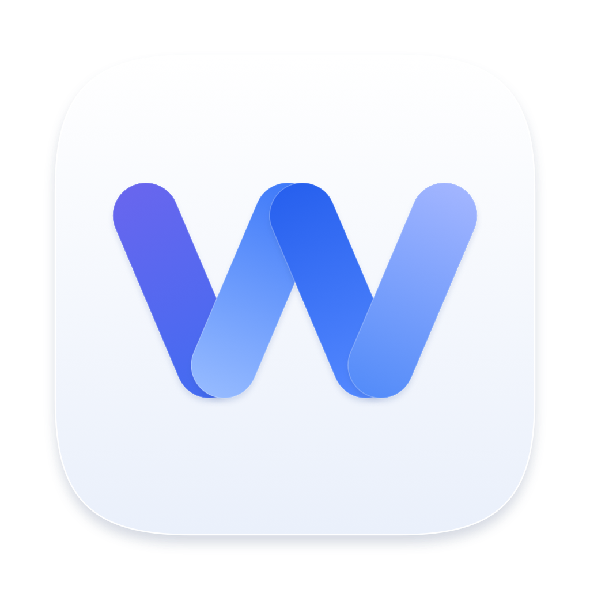
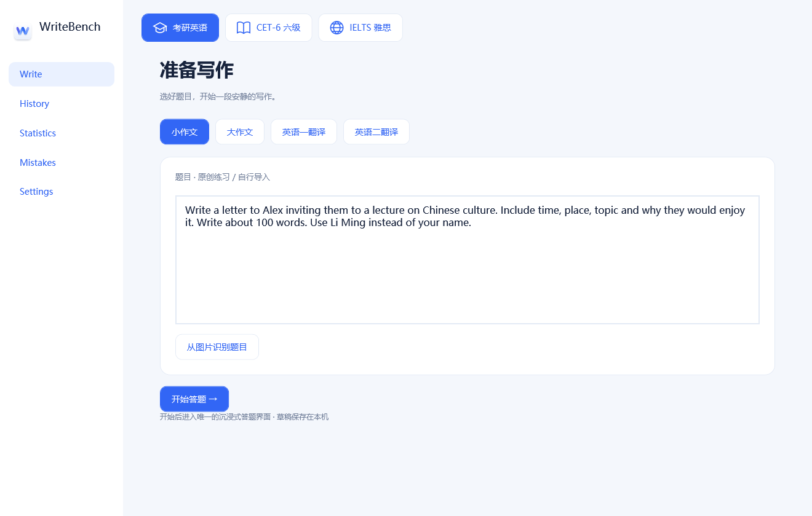
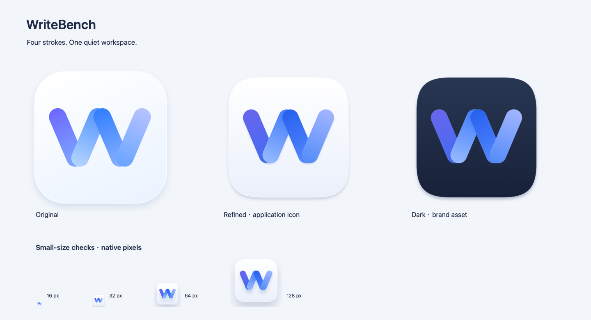

<div align="center">
  
  <h1>WriteBench</h1>
  <p><strong>留一张安静的答题纸，认真写好下一篇。</strong></p>
  <p>原生考试写作工作台 · 沉浸作答 · 三位独立 AI 评审</p>
  <p>
    
    
    
    
  </p>
  <p><a href="https://github.com/Functionhx/WriteBench/releases/latest"><strong>下载最新版</strong></a> · <a href="#开始使用">开始使用</a> · <a href="Documentation/Providers.md">AI 评审架构</a> · <a href="RELEASE-NOTES.md">更新记录</a></p>
</div>

---

## 为一次完整的写作练习而设计

WriteBench 把练习收敛为一条清晰的路径：选题、作答、评阅、重写。点击 **开始答题**，即进入唯一的沉浸式答题页；侧栏和装饰退场，只留下题目、答题区和时间。

| 专注写作 | 认真评阅 | 留下进步 |
| :--- | :--- | :--- |
| 原生全屏作答，自动保存草稿 | 三位评审独立阅读同一份原文 | 完整历史与重写记录 |
| 考研、六级使用横线答题区，不显示实时字数 | 原题要求、语言、组织与语域分别反馈 | 错误归类、趋势与练习统计 |
| 手写稿识别后先校对，再提交 | 本机取中位数，显示评审分歧 | 所有原稿保留在自己的设备上 |

### 支持的考试

<p align="center">　　</p>

| 考试 | 题型 | 评分尺度 |
| :--- | :--- | :--- |
| **考研英语一** | 小作文 · 大作文 · 英译汉 | 10 分 · 20 分 · 10 分 |
| **考研英语二** | 英译汉段落翻译 | 15 分 |
| **CET-6 六级** | 写作 · 汉译英 | 各 15 分练习尺度 |
| **IELTS 雅思 Academic** | Task 1 · Task 2 | 单项任务 Band 9 |

翻译练习重点检查译义、完整性、逻辑关系和目标语言表达；英语一与英语二使用独立 rubric。考研、六级作答期间不显示计词器。

练习分数用于反馈与自查；内置 rubric 是版本化的实践摘要，不是官方阅卷系统。CET-6 不虚构总分换算，IELTS 不把单篇任务分数当作完整 Writing 成绩。

## 下载

到 [GitHub Releases](https://github.com/Functionhx/WriteBench/releases/latest) 下载与你设备对应的文件。每个已发布安装包附带 SHA-256 校验值。

| 平台 | 安装方式 | 当前状态 |
| :--- | :--- | :--- |
| **macOS 15+** | 下载 ZIP / DMG，将 WriteBench.app 放入 Applications | 原生 SwiftUI，Apple silicon + Intel |
| **Windows 11 x64** | [下载便携 ZIP](https://github.com/Functionhx/WriteBench/releases/download/v1.3.0/WriteBench-0.1.0-Windows-x64.zip)，完整解压后运行 WriteBench.exe | 原生 WPF / .NET 10 · 0.1 预览版 |
| **Android 13+** | [下载签名 APK](https://github.com/Functionhx/WriteBench/releases/download/v1.3.0/WriteBench-0.1.0-Android.apk)，在手机安装 | 原生 Android Views · 0.1 预览版 |

macOS 当前是本地 ad-hoc 签名版本，尚未经过 Apple Developer ID 公证；Windows 预览版尚未进行 Authenticode 签名。Windows OCR 需要 Microsoft Visual C++ x64 运行库，详见[平台说明](platforms/windows/README.md)。公开仓库与安装包不包含 API Key、Codex 登录信息或用户作文。

## 开始使用

1. 打开 **Settings**，填写自己的 DeepSeek API Key，点击 **使用此 Key**。默认仅在本次运行内存中保留；macOS 可勾选 **在这台 Mac 上记住 Key**。提交时只读已启用的内存 Key，记住与恢复在后台完成。
2. 使用 Codex 评审时，先安装[官方 Codex CLI](https://learn.chatgpt.com/docs/codex-cli)，在终端运行 `codex login`。已登录的用户直接点击 **Check Connection**，无需再走浏览器。
3. 选择考试与题型，输入题目，或导入题目图片。
4. 点击 **开始答题**，在沉浸式界面完成作文，然后 **交卷**。
5. 阅读三位评审的分数与修改建议，点击 **开始重写** 完成下一稿。

**没有 Key 就提示配置，不会给出假评分。** 演示评分代码只存在于测试目标；任何评审失败都会说明是哪一位，保留草稿，不自动改用另一个服务。

## 三位评审，各自独立

<div align="center">

| Judge A | Judge B | Judge C |
| :---: | :---: | :---: |
| **Rubric examiner** | **Language reviewer** | **Independent examiner** |
| DeepSeek V4 Pro | DeepSeek V4 Pro | GPT-6 Astra · via Codex |
| MAX | MAX | MAX |

</div>

以上是 macOS / Windows 版的默认配置，每个角色都可独立选择 Provider。Android 使用三位独立 DeepSeek 评审，手机无需连接电脑。A 检查考试任务和整体质量，B 深入检查语言，C 从原题与原稿重新作出判断。三者并行运行、互不读取对方输出，只有完整且有效的结构化结果才会交给本机计算中位数。

- **DeepSeek**：官方 API，使用用户自行填写的 Key。
- **ChatGPT · via Codex**：官方本机 CLI，复用用户已有的 ChatGPT 登录，使用 Codex 额度。
- **认证边界**：WriteBench 不读取 Codex 认证文件，不提取 Token，不访问 ChatGPT 私有网页接口。
- **评分可信度**：High / Medium / Low 表示三位评审的一致性，不是对评分正确率的承诺。

模型名称和 MAX 支持于 2026-09-13 核对。账户可用模型与额度仍由对应服务决定。[技术细节与验证记录 →](Documentation/Providers.md)

## 手写稿：先校对，再评分

```text
导入一页或多页图片
          ↓
     本机 OCR 识别
          ↓
原图与识别文字对照 · 逐页校正
          ↓
    确认后才进入三评
```

OCR 误识别不应被算成学生的拼写错误。题目、手写作文或混合照片都先经过确认页。macOS 可分别整理混合照片中的题目和答案；Windows / Android 可按两种用途分别导入并保留对应文字。图表题需把关键数据与图意补充到题目文字中，再进行文本评阅。

## 原生界面与图标

<p align="center"></p>

白色纸面、克制的蓝色、清晰的层级。macOS 使用 SwiftUI 与 AppKit，输入和窗口行为保持原生。Windows 使用 WPF；Android 使用原生 Views。手机布局围绕考试选择、固定开始按钮、软键盘与纵向阅读组织，避免把桌面侧栏缩进小屏。

<p align="center"></p>

W 由四段矢量笔画构成。精修版统一了安全边距、光照和小尺寸笔画；[SVG、PNG、ICNS 源资源](Design/Icon/README.md) 随项目提供。深色图标目前是品牌资源，应用使用浅色图标。

## 本地构建

macOS 需要 Xcode 26.6；Xcode 项目已经生成，无需先安装 XcodeGen。

```sh
git clone https://github.com/Functionhx/WriteBench.git
cd WriteBench
./scripts/build.sh
```

运行测试：

```sh
xcodebuild -project WriteBench.xcodeproj -scheme WriteBench \
  -configuration Debug -derivedDataPath build \
  -destination 'platform=macOS' test
```

```text
WriteBench/          SwiftUI、领域模型、原生服务与 SwiftData
WriteBenchTests/     评分、并发、持久化、OCR 与子进程测试
Design/Icon/         可编辑图标与多尺寸导出
Documentation/      使用说明、验证记录与 Provider 架构
platforms/windows/   WPF 原生应用、OCR 与本地评分
platforms/android/   Android Studio 项目与手机界面
scripts/             构建、图标生成与显式联调脚本
```

macOS 自动化测试覆盖 29 个案例，Android 有 5 个领域测试与 2 个实际设备服务测试；Windows 通过评分、持久化、字段校验及实际 OCR 自检。GPT-6 Astra/MAX 已通过实际 Swift 子进程完成样例评卷；DeepSeek 已验证官方模型接口连接。完整混合三评需用户填入有效 Key 后使用。

<details>
<summary><strong>更多文档</strong></summary>

- [Windows 构建与使用](platforms/windows/README.md)
- [Android Studio 构建与使用](platforms/android/README.md)
- [第三方组件说明](THIRD_PARTY_NOTICES.md)
- [macOS 完整使用说明](Documentation/macOS-guide.md)
- [Provider 架构与认证边界](Documentation/Providers.md)
- [构建与验证记录](Documentation/Validation.md)
- [图标源文件与生成方式](Design/Icon/README.md)
- [版本更新](RELEASE-NOTES.md)

</details>

---

<p align="center">WriteBench · 一次练习，一份原稿，一次认真重写。</p>
