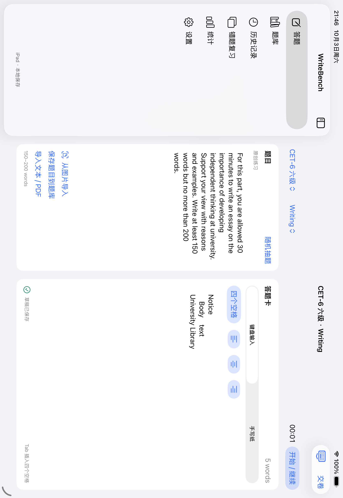
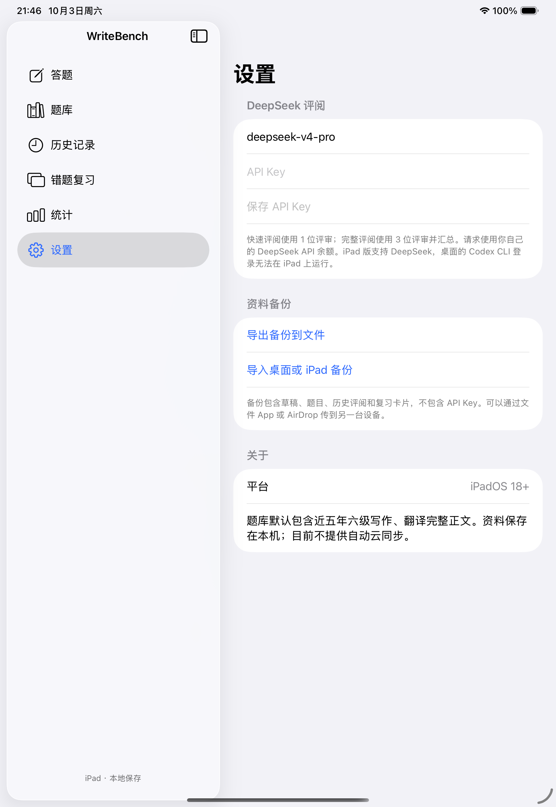

# iPad 验证记录

验证日期：2026-10-03（本机时区）。Xcode 27.0，iPadOS 26.4 模拟器。

| 检查 | 结果 |
| --- | --- |
| iPad Pro 11-inch (M5) | 8 项单元测试、6 项 UI 测试全部通过 |
| iPad mini (A17 Pro) | 同一套 14 项测试全部通过 |
| iOS arm64 设备构建 | 通过，未签名，不作为可安装 IPA |
| macOS 回归 | 87 项原有测试全部通过 |
| 设备族配置 | UIDeviceFamily = [2]，只面向 iPad |

单元测试实际读取内置六级题库（33 写作 + 33 翻译）与全部 rubric，执行真实 Vision OCR，并核对草稿的连续空格、排版和备份数据。题型切换保持独立草稿，间隔复习推进卡片。

UI 测试实际点击题库正文与选题、键盘输入 Tab/空格、交卷后暂停计时、横竖屏导航、PencilKit 笔迹绘制与清空确认、OCR 的必选校对开关，以及切到后台后的计时和草稿状态。OCR 校对 UI 使用调试样本；真实图像 OCR 另由单元测试执行。

未验证实体 iPad、实体 Apple Pencil、多任务窗口拖拽、付费 DeepSeek 评阅或 TestFlight 分发。模拟器运行包采用临时签名；本机没有有效 Apple 开发签名证书。

## 界面预览

CI 的 iPad job 会执行测试并上传 xcresult。真机安装需要配置 Apple 开发 Team，详见 [安装说明](README.md)。
